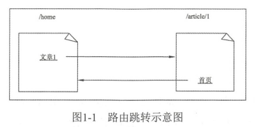

> **传统路由方式用户体验不友好，因此有了SPA，但问题是这种模式下除了首页其余页面是无法直达的，于是需要在前端模拟一套路由机制，来直接访问某个页面。**


## 传统路由方式

传统 Web 都是**多页面**的，每个页面一个 URL ，页面之间通过超链接跳转，由浏览器负责管理页面的跳转、前进、后退等功能，通过指定 URL 可以直接跳转到指定页面。

例如：有一个首页和一个文章页，首页是一个 URL，文章页是一个 URL，可以从首页跳转到文章页，然后再从文章页跳转到首页，这一切都由浏览器完成。




传统页面路由方式，**用户体验不友好** ，于是更友好的单页面应用来了 ，也被称为 Web App 。

**在这种模式下整个应用只有一个传统的页面，传统模式下的多个页面被抽象成一个视图，原来的页面跳转，此时由 JavaScript 负责切换视图；**

原来向后端请求整个页面，现在变成向后端请求数据接口， 因为不需要刷新页面，体验非常好。

但这种方式有一个问题，就是除了首页，其他页面是无法直接到达的，也就是每次都要先进到首页；为了能够实现传统 Web 那种 URL 的优点，**需要在前端模拟一套路由机制，有了路由就可以通过 URL 直接进入某个视图了。**

-------------

## vue-router

hash模式在地址栏显示的时候是已哈希的形式：#/xxx，这种方式使用和部署简单，但是不会被搜索引擎处理，seo有问题；

history模式则建议用在大部分web项目上，但是它要求应用在部署时做特殊配置，服务器需要做回退处理，否则会出现刷新页面404的问题。

-------

## 刷新页面404的问题

由于应用是一个单页的客户端应用，如果没有适当的服务器配置，用户在浏览器中直接访问 `https://example.com/user/id`，就会得到一个 404 错误。

要解决这个问题，你需要做的就是在你的服务器上添加一个简单的回退路由。如果 URL 不匹配任何静态资源，它应提供与你的应用程序中的 `index.html` 相同的页面。

```nginx
location / {
  try_files $uri $uri/ /index.html;
}
```

