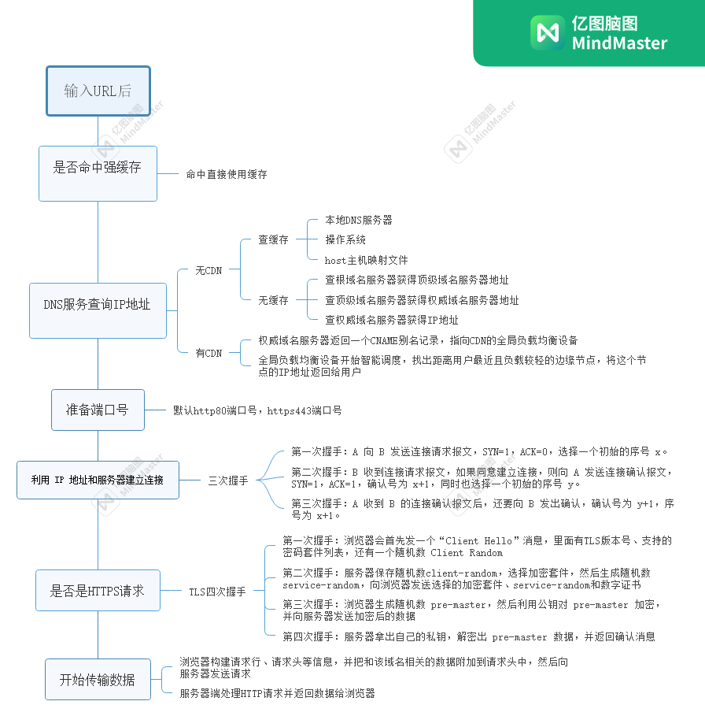

> **:heavy_exclamation_mark: 用户发出 URL 请求到页面开始解析的这个过程，就叫做导航。**

:one: **用户输入url并回车后，浏览器进程检查url**

如果没有协议，则会加上协议，构成完整的url。

:two: **浏览器进程会通过进程间通信（IPC）把 URL 请求发送至网络进程**

:three: **网络进程首先检查本地缓存是否缓存了该请求资源，如果有则将该资源返回。如果在缓存中没有查找到资源，那么进入网络请求流程**

:four: **首先进行 DNS 解析，获取请求域名的服务器 IP 地址**

:five: **拿到 IP 之后，接下来就需要获取端口号了。通常情况下，如果 URL 没有特别指明端口号，那么 HTTP 协议默认是 80 端口**

:six: **等待 TCP 队列**

现在已经把端口和 IP 地址都准备好了，那么下一步是不是可以建立 TCP 连接了呢？

答案依然是“不行”。Chrome 有个机制，同一个域名同时最多只能建立 6 个 TCP 连接，如果在同一个域名下同时有 10 个请求发生，那么其中 4 个请求会进入排队等待状态，直至进行中的请求完成。

当然，如果当前请求数量少于 6，会直接进入下一步，建立 TCP 连接。

:seven: **利用 IP 地址和服务器建立 TCP 连接，需经过三次握手**

:eight: **如果是 https 请求，还需要经过 TLS 握手流程**

:nine: **浏览器开始构建 http 请求，然后发给服务器**

浏览器端会构建请求行、请求头等信息，并把和该域名相关的 Cookie 等数据附加到请求头中，然后向服务器发送构建的请求信息。

:keycap_ten:**服务器端处理 HTTP 请求**

一旦服务器处理结束，便可以返回数据给浏览器了。

:arrow_down_small: **网络进程解析响应头，如果发现返回的状态码是 301 或者 302，那么网络进程会从响应头的 LOCATION 字段读取重定向的地址，然后再发起新的网络请求；如果返回 304，则使用本地缓存资源；如果返回 404，则表示找不到页面**

:arrow_down_small: **如果响应行状态码是200，浏览器会通过Content-Type 字段的值来检查响应体类型** 

:arrow_down_small: **如果是字节流类型，则将该请求提交给下载管理器，同时导航流程结束**

:arrow_down_small: **如果是 html 类型，则网络进程通知浏览器进程为该请求创建一个渲染进程**

:arrow_down_small: **渲染进程准备好后，浏览器进程向渲染进程发起“提交文档”的消息，渲染进程接收到消息和网络进程建立传输数据的“管道”，等接收完数据后，向浏览器发送“确认提交”**

:arrow_down_small: **浏览器进程接收到确认消息后更新浏览器界面状态：安全、地址栏url、前进后退的历史状态、更新web页面**

